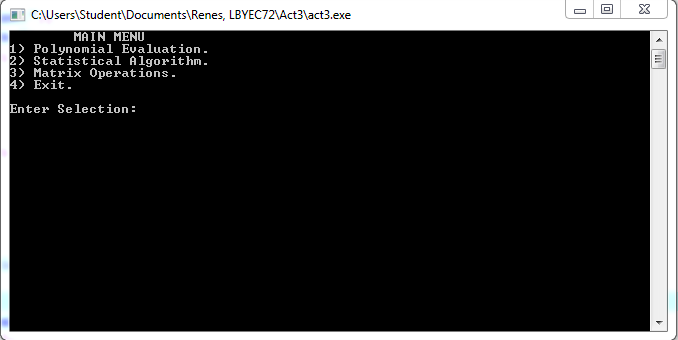
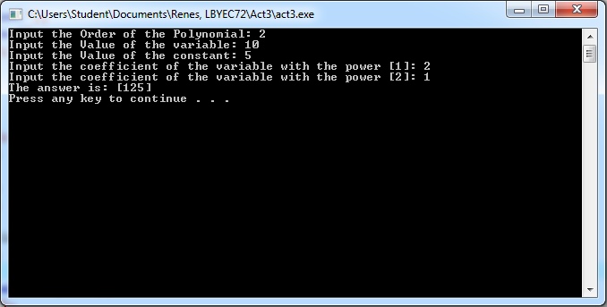
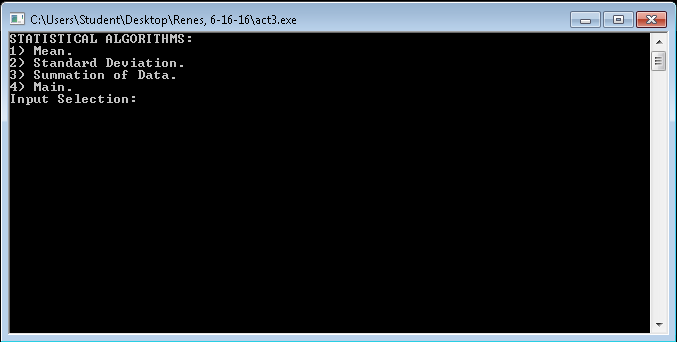
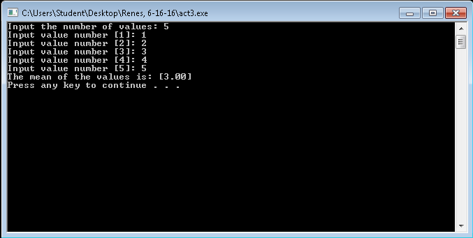
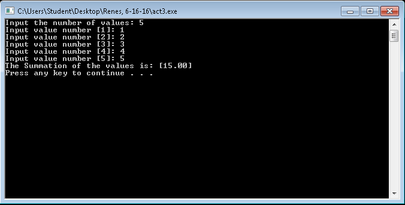
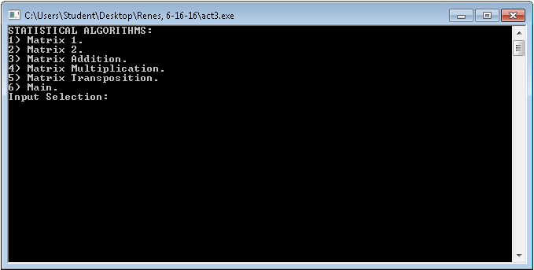
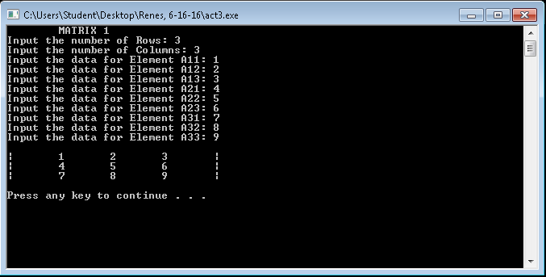

# lbyec72-ei2-p3-single_multidimensional_arrays-davidrenes
lbyec72-ei2-p3-single_multidimensional_arrays-davidrenes created by GitHub Classroom
<h3>Menu</h3>

<h3>Polynomial</h3>

<h3>Statistical Algorithm</h3>

<h3>Mean</h3>

<h3>Standard Deviation</h3>

<h3>Summation</h3>

<h3>Matrix Operations</h3>

<h3>Matrix 1</h3>

<h3>Matrix 2</h3>

