# lbyec72-ei2-p3-single_multidimensional_arrays-davidrenes
lbyec72-ei2-p3-single_multidimensional_arrays-davidrenes created by GitHub Classroom
<h3>Menu</h3>
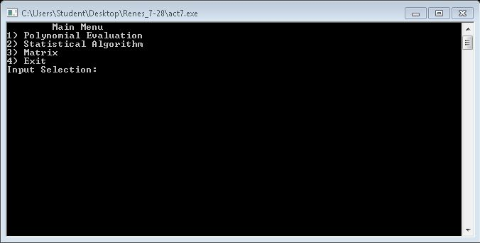
<h3>Polynomial</h3>
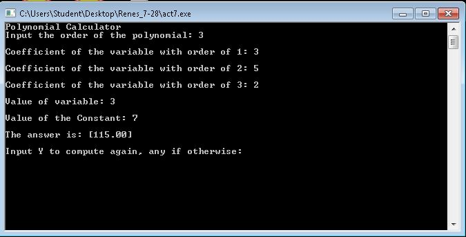
<h3>Statistical Algorithm Data Input</h3>
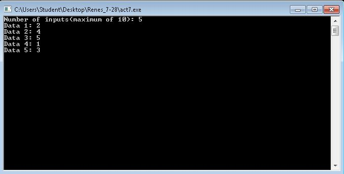
<h3>Statistical Algorithm Menu</h3>
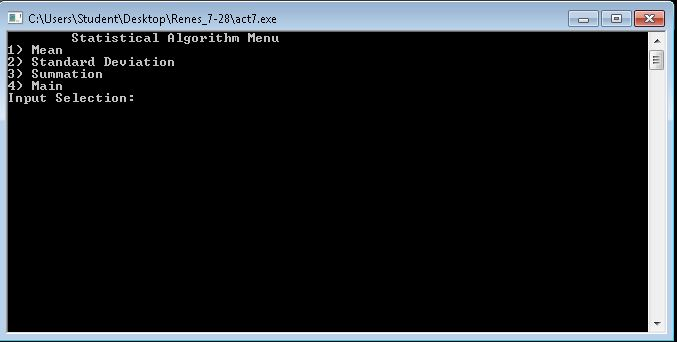
<h3>Mean</h3>
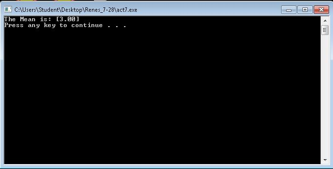
<h3>Standard Deviation</h3>
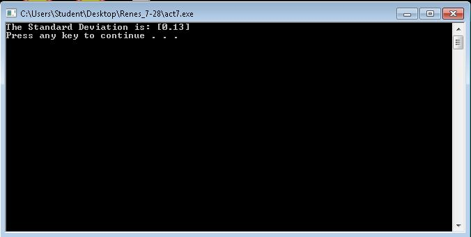
<h3>Summation</h3>
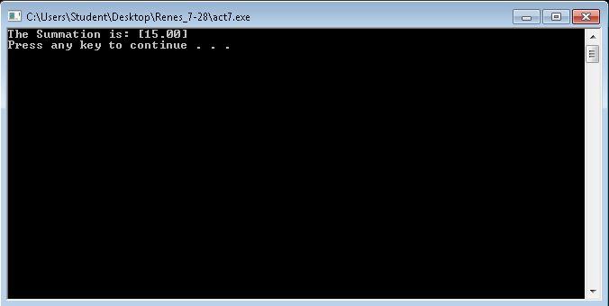
<h3>Matrix Menu</h3>
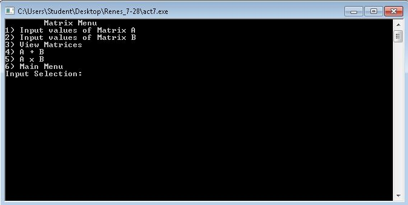
<h3>Matrix 1</h3>
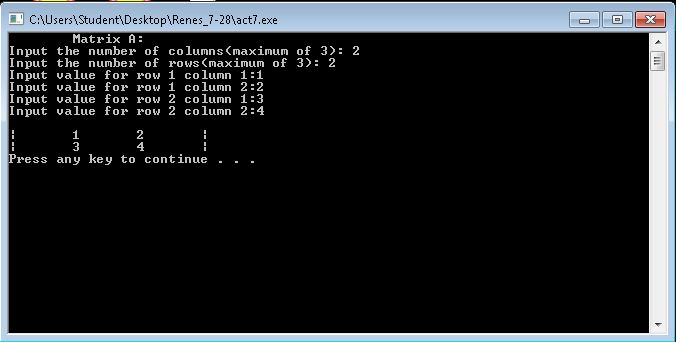
<h3>Matrix 2</h3>
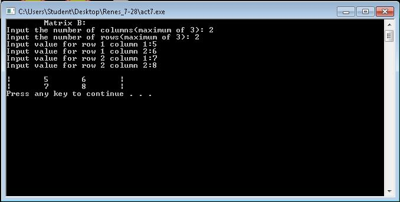
<h3>Show Both Matrices</h3>
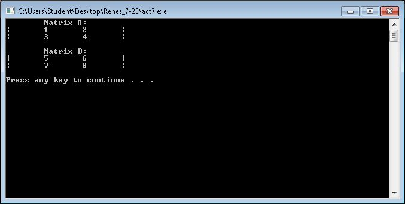
<h3>A + B</h3>
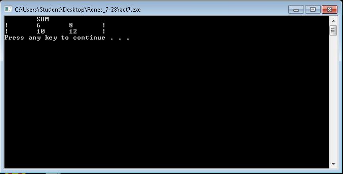
<h3>A x B</h3>
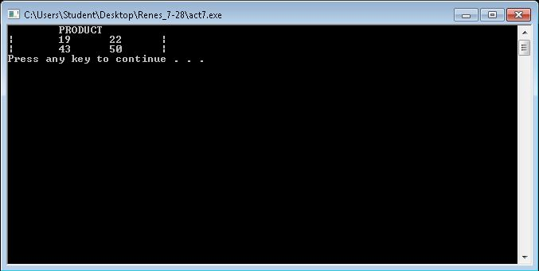
<h3>Transpose of Matrix A</h3>
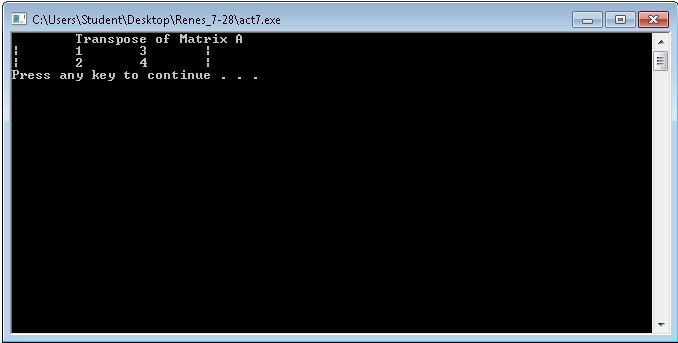
<h3>Transpose of Matrix B</h3>
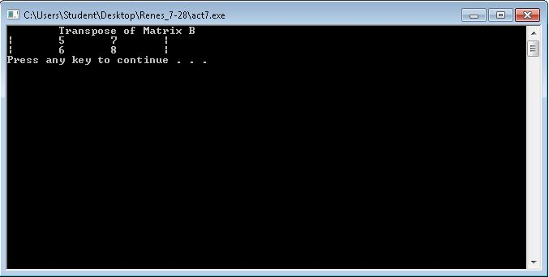
